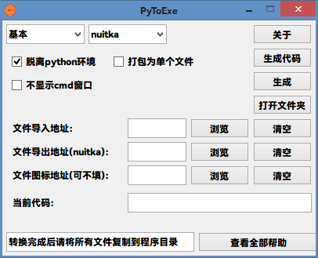

# PyToExe
> <a herf="./README_CN.md">中文说明</a> || <a herf="/README.md">English</a>
> 译者：@BiliBiliSmallball
## 软件总览
PyToExe 是基于 Python 的软件。 
它可以帮助您将 python 文件打包成可执行程序。 
它提供了一个GUI界面，用于自定义打包，您只需单击即可打包 python 文件。 
本软件调用 pyinstaller 和 nuitka 来帮助打包文件。 
现在该软件的用途是中文的，因为作者和译者来自中国。（所以这个文件可能有很多语法错误。 
现在，您仍然无法更改显示语言，因为我没有进行语言的配置。 
<del>请等待我们的更新</del>等个屁，我堵他基本不更了
## 工作原理与介绍
该软件基于Python模块tkinter进行构建。 
要将 python 文件打包成可执行程序，它会调用 pyinstaller 或 nuitka。 
## 代码说明
### 需要的模块
以下是该程序所需的所有模块及其用途：   
|包|用途|
|:---|:---|
|tkinter|interface based|
|tkinter.messagebox|message popup|
|tkinter.ttk|interface based|
|os|system orders called|
|time|animation needed|
|threading|more threads builded|
|random|random number made|

### self_builede模块
以下是所有自建模块及其用途： 

|模块|用途|
|:---|:---|
|constant|constant saved|
|option|interface builded|
|function|packaging|  
### 如何使用该程序
点击 `main.py`使用
为啥这个项目不打包一下？

### File main.py
在模块 `main.py`中,我们使用这些代码来构建接口和函数: 

~~~python
if __name__ == "__main__":
  window = Window()  # 创建主窗口
  desktop = Desktop(master=window)  #创建接口

  window.mainloop()  #显示主窗口
~~~

变量 *window* 是所有功能实现的基础变量.

### File constant.py
In file constant.py,I write some variables into it. 
Like this: 

~~~python
INSTALL_TEXT = [
  "pip install pyinstaller",
  "pip install nuitka"
]
~~~

These strings are to install pyinstaller and nuitka for packaging. 

### File function.py
In file function.py,we build a function: 
> make_file(file_from_path, file_output_path="", file_icon_path="", tool="pyinstaller", module="Basic", if_python=False, one_file=(False, True),
if_cmd=(False, False))

to build executable programs. 
We just convert parameters into codes and rutuen final result *test* 
Like this: 

~~~python
text = ""
if tool == COMBOBOX_TEXT[1][1]:  # pyinstaller called
  text += COMBOBOX_TEXT[1][1]  # write "pyinstaller" at the front
  if one_file[1]:  # one_file setted
    text += " %s" % PYINSTALLER_TEXTS[1]  # write "-w" behind "pyinstaller"
~~~

### File option.py
In file option.py,we build the interface of the program.The place with the most codes is just here. 

Here is all the class and their purposes in the file: 

|class|purposes|
|:---|:---|
|Window(tk.Tk)|root window builded|
|Desktop(tk.Frame)|main interface builded|
|ToplevelAbout(tk.Toplevel)|build About window|
|ToplevelInfo(tk.Toplevel)|build help window|

#### Window(tk.Tk)
In this class, there is a function called set(self) that can set the root window.

Here are the explanations of the codes: 

~~~python
self.screenwidth = self.winfo_screenwidth()
self.screenheight = self.winfo_screenheight()
self.x = (self.screenwidth - WINDOW_WIDTH) / 2
self.y = (self.screenheight - WINDOW_HEIGHT) / 2
self.size = "%dx%d+%d+%d" % (WINDOW_WIDTH, WINDOW_HEIGHT, self.x, self.y)
~~~

Get the width and the height of the screen:
> self.screenwidth = self.winfo_screenwidth()
>
> self.screenheight = self.winfo_screenheight()

Get the x coordinate and y coordinate:
> self.x = (self.screenwidth - WINDOW_WIDTH) / 2
>
> self.y = (self.screenheight - WINDOW_HEIGHT) / 2

#### Desktop(tk.Frame)
In this class, also the-most-code-written place, we build the main interface. 

Here is all the functions that are called in \_\_init\_\_(self, master) ,the functions these functions called in this class,  the variable globalized in there functions and the variable there functions needed: 

|function|function called|variable globalized|variable needed|
|:---|:---|:---|:---|
|set_place()|/|/|/|
|set_combobox()|self.change_checkbutton_frame(tool)|/|self.combobox1_var self.combobox2_var|
|checkbutton()|/|frame1 frame2|self.checkbutton1_1_var self.checkbutton1_2_var self.checkbutton1_3_var|
|change_checkbutton_frame(tool)|/|/|/|
|sidebar()|self.make_toplevel_about() self.make_code() self.make_exe() self.open_output_dic()|button_3|/|
|entry_file|self.choose_file_from() self.choose_file_output() self.choose_file_icon()|/|self.file_from_path_var self.file_output_path_var self.file_icon_path_var|
|console_order_entry()|/|/|self.console_order_var|
|install()|/|/|/|
|info()|self.change_info_label()|/|/|

There are a bit too much.It doesn't matter.Just let me introduce some of them.

##### info()
I think you know how to make interface by tkinter, so I won't introduce the functions of building tkinter interface.(The true reason is that I'm a bit lazy.) 

Now I only introduce the Function info().Look at the codes first: 
> thread_change = Thread(target=self.change_info_label, args=())
>
> thread_change.start()

These codes are to build a now thread to make the main program not getting caton.

We know this function called a new function called self.change_info_label(). 
Then let we just check out this function. 

###### self.change_info_label()
~~~python
n = 0
while True:
  n_ = random.randint(0, len(INFO_LABEL_TEXTS)-1)
  if n_ == n:
    continue
  else:
    n = n_
    self.entry_var.set(INFO_LABEL_TEXTS[n])
    self.master.update()
    time.sleep(10)
~~~
Look at the codes above. 
We first make a temporary variable called *n*. 
Then, we build a *while* circulate. 
In this circulate, we first make a random number as the index of the list. 
If the random number *n_* is as same as *n*, we just "while" again. 
Then we use the index to choose the element in the list and take it as the element of the variable self.entry_var. 
Then, we use the module time and its function sleep() to pause the thread for 10 seconds. 
Then, the next "while" again. 
It is not difficult if you now a little of python grammar. 

#### ToplevelAbout(tk.Toplevel) and ToplevelInfo(tk.Toplevel)
As you know, they are seem to be same.So I just choose one of them for the introduction. 

Building window is like the steps in class Window(tk.Tk) 
building label to show the about information is a bit easy.

Something we need to know is that we can change the value of the element justify in the class tk.Label(). 
Like this: 

> text = tk.Label(self, text=ABOUT_TEXT, justify="left")
>
> text.place(x=0, y=0, width=TOPLEVEL_WIDTH * 3)

Here are the differences of *justify* and *anchor*: 

|element|value|purpose|
|:---|:---|:---|
|justify|left right center |For lines|
|anchor|e w n s ne se nw sw center|for one line|

Here are the means of the possible values of the element *anchor*: 
|value|mean|
|:---|:---|
|e|East|
|w|West|
|n|north|
|s|south|
|ne|northeast|
|se|southeast|
|nw|northwest|
|sw|southwest|
|center|center|

## Download
### Codes Downloaded
1. Github:
  1. [Codes on Github(the lastest)](https://github.com/Lonely-Pea/PyToExe.git "Click to download")
2. Lanzouy:
  1. [PyToExe Build 230804 v1.0.0](https://wwcs.lanzouy.com/ifvRo14rzrlg "Click to download")
  2. [PyToExe Build 230813 v1.1.0](https://wwcs.lanzouy.com/iAy9f15ajtsd "Click to download")

### Executable Porgrams Downloaded
1. Lanzouy:
  1. [PyToExe Build 230804 v1.0.0](https://wwcs.lanzouy.com/ib5RM14rzs9a "Click to download")
  2. [PyToExe Build 230813 v1.1.0](https://wwcs.lanzouy.com/iInhb15ajusj "Click to download")

## PyToExe Official Website
[PyToExe Official Website](https://lonely-pea.github.io/PyToExeWeb "Click to go to")

## Bug Feedback
Send email to <lonely-pea@qq.com> to give bug feedback or your suggestions.
If you don't get something well, you can also ask me by sending email to this mainbox.

## Software Screenshot
Here are the screenshots of this software(version: Build 230813 v1.1.0): 

## thanks
Thank Lonely-Pea for programming. 
Thank Everybody who give supports for this program. 
Could you star it if you think it is a excellent program? 
