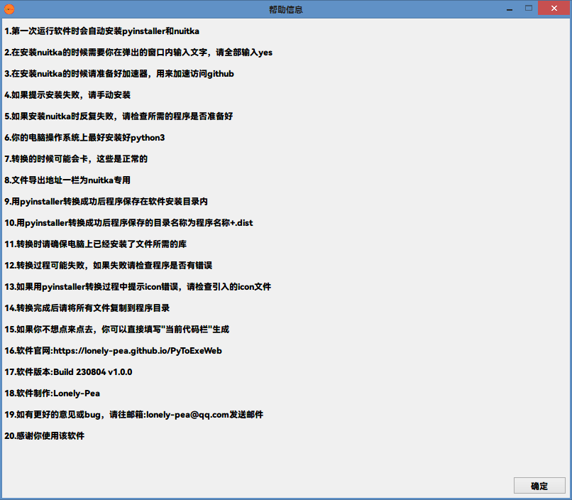

# PyToExe

> <a herf="./README_CN.md">中文说明</a> || <a herf="/README.md">English</a>
> 译者：@BiliBiliSmallball

## 软件总览

PyToExe 是基于 Python 的软件。<br>
它可以帮助您将 python 文件打包成可执行程序。<br>
它提供了一个 GUI 界面，用于自定义打包，您只需单击即可打包 python 文件。<br>
本软件调用 pyinstaller 和 nuitka 来帮助打包文件。<br>
现在该软件的用途是中文的，因为作者和译者来自中国。（所以这个文件可能有很多语法错误。<br>
现在，您仍然无法更改显示语言，因为我没有进行语言的配置。<br>
请等待我们的更新<br>

## 工作原理与介绍

该软件基于 Python 模块 tkinter 进行构建。<br>
要将 python 文件打包成可执行程序，它会调用 pyinstaller 或 nuitka。<br>

## 代码说明

### 需要的模块

以下是该程序所需的所有模块及其用途：<br>  
|包|用途|
|:---|:---|
|tkinter|interface based|
|tkinter.messagebox|message popup|
|tkinter.ttk|interface based|
|os|system orders called|
|time|animation needed|
|threading|more threads builded|
|random|random number made|

### self_builede 模块

以下是所有自建模块及其用途：<br>

| 模块     | 用途              |
| :------- | :---------------- |
| constant | constant saved    |
| option   | interface builded |
| function | packaging         |

### 如何使用该程序

点击 `main.py`使用<div style="font-size:10px">为啥这个项目不打包一下？</div>

### File main.py

在模块 `main.py`中,我们使用这些代码来构建接口和函数:<br>

```python
if __name__ == "__main__":
  window = Window()  # 创建主窗口
  desktop = Desktop(master=window)  #创建接口

  window.mainloop()  #显示主窗口
```

变量 _window_ 是所有功能实现的基础变量。如需更改功能请在对象 window 中更改或添加相关属性

### File constant.py

在项目`constant.py`中,我写了一些设置参数在里面.<br>
比如:<br>

```python
INSTALL_TEXT = [
  "pip install pyinstaller",
  "pip install nuitka"
]
```

这些字符串用于安装 pyinstaller 和 nuitka 进行打包。<br>

### function.py

在文件 function.py 中，我们构建一个函数<br>

> make_file（file_from_path， file_output_path=“”， file_icon_path=“”， tool=“pyinstaller”， module=“Basic”， if_python=False， one_file=（False， True），
> if_cmd=（False，False））

以构建可执行程序。<br>
我们只是将参数转换为代码并查看最终结果*test*<br>
例如：

```python
text = ""
if tool == COMBOBOX_TEXT[1][1]:  # pyinstaller called
  text += COMBOBOX_TEXT[1][1]  # write "pyinstaller" at the front
  if one_file[1]:  # one_file setted
    text += " %s" % PYINSTALLER_TEXTS[1]  # write "-w" behind "pyinstaller"
```

### File option.py

在文件 option.py 中，我们构建程序的接口。代码最多的地方就在这里。<br>

以下是文件中的所有类及其用途：<br>

| class                      | purposes               |
| :------------------------- | :--------------------- |
| Window(tk.Tk)              | root window builded    |
| Desktop(tk.Frame)          | main interface builded |
| ToplevelAbout(tk.Toplevel) | build About window     |
| ToplevelInfo(tk.Toplevel)  | build help window      |

#### Window(tk.Tk)

在这个类中，有一个名为 set（self） 的函数可以设置根窗口。

以下是代码的解释：<br>

```python
self.screenwidth = self.winfo_screenwidth()
self.screenheight = self.winfo_screenheight()
self.x = (self.screenwidth - WINDOW_WIDTH) / 2
self.y = (self.screenheight - WINDOW_HEIGHT) / 2
self.size = "%dx%d+%d+%d" % (WINDOW_WIDTH, WINDOW_HEIGHT, self.x, self.y)
```

通过以下属性确定程序窗口位置：

> self.screenwidth = self.winfo_screenwidth()
>
> self.screenheight = self.winfo_screenheight()

通过以下属性确定程序窗口的大小：

> self.x = (self.screenwidth - WINDOW_WIDTH) / 2
>
> self.y = (self.screenheight - WINDOW_HEIGHT) / 2

#### Desktop(tk.Frame)

在这个类中，也是代码编写最多的地方，我们构建了主界面。<br>

以下是在 **init**（self， master） 中调用的所有函数，这些函数在此类中调用的函数，变量 globalized in there 函数和变量 there 函数需要：<br>

| function                       | function called                                                                             | variable globalized | variable needed                                                                 |
| :----------------------------- | :------------------------------------------------------------------------------------------ | :------------------ | :------------------------------------------------------------------------------ |
| set_place()                    | /                                                                                           | /                   | /                                                                               |
| set_combobox()                 | self.change_checkbutton_frame(tool)                                                         | /                   | self.combobox1_var<br>self.combobox2_var                                        |
| checkbutton()                  | /                                                                                           | frame1<br>frame2    | self.checkbutton1_1_var<br>self.checkbutton1_2_var<br>self.checkbutton1_3_var   |
| change_checkbutton_frame(tool) | /                                                                                           | /                   | /                                                                               |
| sidebar()                      | self.make_toplevel_about()<br>self.make_code()<br>self.make_exe()<br>self.open_output_dic() | button_3            | /                                                                               |
| entry_file                     | self.choose_file_from()<br>self.choose_file_output()<br>self.choose_file_icon()             | /                   | self.file_from_path_var<br>self.file_output_path_var<br>self.file_icon_path_var |
| console_order_entry()          | /                                                                                           | /                   | self.console_order_var                                                          |
| install()                      | /                                                                                           | /                   | /                                                                               |
| info()                         | self.change_info_label()                                                                    | /                   | /                                                                               |

There are a bit too much.It doesn't matter.Just let me introduce some of them.

##### info()

我想你知道如何用 tkinter 制作接口，所以我就不介绍搭建 tkinter 接口的功能了。（真正的原因是我有点懒。<h5>译者注：看出来了</h5><br>

现在我只介绍函数 info（）。先看一下代码：<br>

> thread_change = Thread(target=self.change_info_label, args=())
>
> thread_change.start()

这些代码是为了构建一个 now 线程，使主程序不会停滞（？）。

我们得到这个函数叫做一个名为 self.change_info_label（） 的新函数。<br>
然后让我们看看这个函数。<br>

###### self.change_info_label()

```python
n = 0
while True:
  n_ = random.randint(0, len(INFO_LABEL_TEXTS)-1)
  if n_ == n:
    continue
  else:
    n = n_
    self.entry_var.set(INFO_LABEL_TEXTS[n])
    self.master.update()
    time.sleep(10)
```

看看上面的代码。<br>
我们首先制作一个名为 _n_ 的临时变量。<br>
然后，我们建立一个 _while_ 循环。<br>
在这个循环中，我们首先选取一个随机数作为列表的索引。<br>
如果随机数 _n\_\_ 与 \_n_ 相同，我们再次“while”。<br>
然后我们使用索引来选择列表中的元素，并将其作为变量 self.entry_var 的元素。<br>
然后，我们使用模块 time 及其函数 sleep（） 将线程暂停 10 秒。<br>
然后，下一个“while”再次出现。<br>
如果你现在有基础的 python 语法，这并不难。<br>

#### ToplevelAbout(tk.Toplevel) and ToplevelInfo(tk.Toplevel)

如您所知（+4），它们几乎是一样的。所以此处我只选择其中之一作为介绍。<br>

构建窗口类似于 Window（tk.Tk）<br>
利用 Lable 控件来显示信息明显更加容易

我们可以更改` tk 类`中元素的`justify`属性的值来改变标签内容。<br>
例如:<br>

> text = tk.Label(self, text=ABOUT_TEXT, justify="left")
>
> text.place(x=0, y=0, width=TOPLEVEL_WIDTH \* 3)

以下是 _justify_ 和 _anchor_ 的区别：<br>

| 元素    | 预设值                                             | 类别         |
| :------ | :------------------------------------------------- | :----------- |
| justify | left<br>right<br>center<br>                        | For lines    |
| anchor  | e<br>w<br>n<br>s<br>ne<br>se<br>nw<br>sw<br>center | for one line |

以下列表指出了控件在 `_anchor_` 魔法方法中所拥有的位置 if **name** == "**main**":
import sys
my*app = QtWidgets.QApplication(sys.argv)
MainWindow = QtWidgets.QMainWindow()
ui = Ui_MainWindow()
ui.setupUi(MainWindow)
MainWindow.show()
sys.exit(my_app.exec*())属性:<br>
|参数名|指向方向|
|:---|:---|
|e|East|
|w|West|
|n|north|
|s|south|
|ne|northeast|
|se|southeast|
|nw|northwest|
|sw|southwest|
|center|center|

## 下载

### 代码下载

1. Github:
1. [Codes on Github(the lastest)](https://github.com/Lonely-Pea/PyToExe.git "Click to download")
1. Lanzouy:
1. [PyToExe Build 230804 v1.0.0](https://wwcs.lanzouy.com/ifvRo14rzrlg "Click to download")
1. [PyToExe Build 230813 v1.1.0](https://wwcs.lanzouy.com/iAy9f15ajtsd "Click to download")

### 版本下载地址

1. Lanzouy:
1. [PyToExe Build 230804 v1.0.0](https://wwcs.lanzouy.com/ib5RM14rzs9a "Click to download")
1. [PyToExe Build 230813 v1.1.0](https://wwcs.lanzouy.com/iInhb15ajusj "Click to download")

## PyToExe 项目主页

[PyToExe Official Website](https://lonely-pea.github.io/PyToExeWeb "Click to go to")

## Bug 反馈

向 <lonely-pea@qq.com> 发送电子邮件以提供错误反馈或您的建议。
如果你没有得到什么，你也可以通过向这个主箱发送电子邮件来问我。

## 项目截图

H 首先是该软件的屏幕截图（来自版本：Build 230813 v1.1.0）:<br>




## 特别鸣谢

感谢 Lonely-Pea 的编程，以及@BiliBiliSmallball 的翻译<br>
感谢所有支持该计划的人。<br>
如果你认为这是一个优秀的节目，你能给它右上角单击星标吗？<br>
